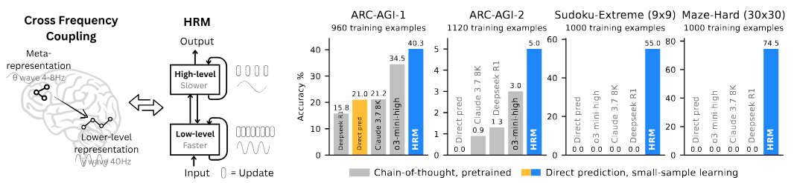

# Hierarchical Reasoning Model



Reasoning, the process of devising and executing complex goal-oriented action sequences, remains a critical challenge in AI.
Current large language models (LLMs) primarily employ Chain-of-Thought (CoT) techniques, which suffer from brittle task decomposition, extensive data requirements, and high latency. Inspired by the hierarchical and multi-timescale processing in the human brain, we propose the Hierarchical Reasoning Model (HRM), a novel recurrent architecture that attains significant computational depth while maintaining both training stability and efficiency.
HRM executes sequential reasoning tasks in a single forward pass without explicit supervision of the intermediate process, through two interdependent recurrent modules: a high-level module responsible for slow, abstract planning, and a low-level module handling rapid, detailed computations. With only 27 million parameters, HRM achieves exceptional performance on complex reasoning tasks using only 1000 training samples. The model operates without pre-training or CoT data, yet achieves nearly perfect performance on challenging tasks including complex Sudoku puzzles and optimal path finding in large mazes.
Furthermore, HRM outperforms much larger models with significantly longer context windows on the Abstraction and Reasoning Corpus (ARC), a key benchmark for measuring artificial general intelligence capabilities.
These results underscore HRM’s potential as a transformative advancement toward universal computation and general-purpose reasoning systems.

 
## Quick Start Guide 🚀

### Prerequisites ⚙️

Ensure PyTorch and CUDA are installed. The repo needs CUDA extensions to be built. If not present, run the following commands:

```bash
# Install CUDA 12.6
CUDA_URL=https://developer.download.nvidia.com/compute/cuda/12.6.3/local_installers/cuda_12.6.3_560.35.05_linux.run

wget -q --show-progress --progress=bar:force:noscroll -O cuda_installer.run $CUDA_URL
sudo sh cuda_installer.run --silent --toolkit --override

export CUDA_HOME=/usr/local/cuda-12.6

# Install PyTorch with CUDA 12.6
PYTORCH_INDEX_URL=https://download.pytorch.org/whl/cu126

pip3 install torch torchvision torchaudio --index-url $PYTORCH_INDEX_URL

# Additional packages for building extensions
pip3 install packaging ninja wheel setuptools setuptools-scm
```

Then install FlashAttention. For Hopper GPUs, install FlashAttention 3

```bash
git clone git@github.com:Dao-AILab/flash-attention.git
cd flash-attention/hopper
python setup.py install
```

For Ampere or earlier GPUs, install FlashAttention 2

```bash
pip3 install flash-attn
```

## Install Python Dependencies 🐍

```bash
pip install -r requirements.txt
```

## W&B Integration 📈

This project uses [Weights & Biases](https://wandb.ai/) for experiment tracking and metric visualization. Ensure you're logged in:

```bash
wandb login
```

## Run Experiments

### Quick Demo: Lisp Simplification 💻

Generate a symbolic expression simplification dataset and train HRM on it.

```bash
# Build Lisp dataset (defaults to data/lisp-simplification)
python dataset/build_lisp_dataset.py --output-dir data/lisp-simplification

# Start training (single GPU)
OMP_NUM_THREADS=8 python pretrain.py --config-name cfg_pretrain_lisp
```

Tip: For multi-GPU, use `torchrun --nproc-per-node 8 pretrain.py --config-name cfg_pretrain_lisp`.

## Trained Checkpoints 🚧

 - [ARC-AGI-2](https://huggingface.co/sapientinc/HRM-checkpoint-ARC-2)

To use the checkpoints, see Evaluation section below.

## Full-scale Experiments 🔵

Experiments below assume an 8-GPU setup.

### Dataset Preparation

```bash
# Initialize submodules
git submodule update --init --recursive

# ARC-1
python dataset/build_arc_dataset.py  # ARC offical + ConceptARC, 960 examples
# ARC-2
python dataset/build_arc_dataset.py --dataset-dirs dataset/raw-data/ARC-AGI-2/data --output-dir data/arc-2-aug-1000  # ARC-2 official, 1120 examples

# Lisp simplification
python dataset/build_lisp_dataset.py --output-dir data/lisp-simplification
```

### Dataset Visualization

Explore the Lisp dataset visually:

* Open `puzzle_visualizer.html` (Lisp Dataset Visualizer) in your browser.
* Upload the generated dataset folder located in `data/lisp-simplification`.

## Launch experiments

### Small-sample (1K)

ARC-1:

```bash
OMP_NUM_THREADS=8 torchrun --nproc-per-node 8 pretrain.py 
```

*Runtime:* ~24 hours

ARC-2:

```bash
OMP_NUM_THREADS=8 torchrun --nproc-per-node 8 pretrain.py data_path=data/arc-2-aug-1000
```

*Runtime:* ~24 hours (checkpoint after 8 hours is often sufficient)

Lisp Simplification:

```bash
OMP_NUM_THREADS=8 torchrun --nproc-per-node 8 pretrain.py --config-name cfg_pretrain_lisp
```

### Notes

## Evaluation

Evaluate your trained models:

* Check `eval/exact_accuracy` in W&B.
* To export predictions and metrics from a checkpoint:

```bash
OMP_NUM_THREADS=8 torchrun --nproc-per-node 8 evaluate.py checkpoint=<CHECKPOINT_PATH>
```

For the Lisp dataset, you can open `lisp_eval.ipynb` to interactively inspect saved outputs.

## Notes

 - Small-sample learning typically exhibits accuracy variance of around ±2 points.
 - For Sudoku-Extreme (1,000-example dataset), late-stage overfitting may cause numerical instability during training and Q-learning. It is advisable to use early stopping once the training accuracy approaches 100%.

## Citation 📜

```bibtex
@misc{wang2025hierarchicalreasoningmodel,
      title={Hierarchical Reasoning Model}, 
      author={Guan Wang and Jin Li and Yuhao Sun and Xing Chen and Changling Liu and Yue Wu and Meng Lu and Sen Song and Yasin Abbasi Yadkori},
      year={2025},
      eprint={2506.21734},
      archivePrefix={arXiv},
      primaryClass={cs.AI},
      url={https://arxiv.org/abs/2506.21734}, 
}
```
